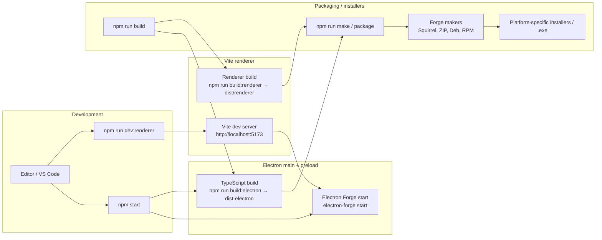

# Electron React Vite Template

Desktop application template built with:

- Electron + Electron Forge
- Vite + React + TypeScript
- Zustand for renderer state management
- Bootstrap + SCSS for UI
- Vitest for unit tests
- ESLint + Prettier + Husky + lint-staged
- Local SQLite via **sql.js** (pure JS/WASM client) and TCP event handling, with an optional remote backend (e.g. Postgres/MySQL) for online sync

---

## Architecture goals

- Clearly separate **Electron processes**:
  - `main` (Node, OS/DB/TCP access)
  - `preload` (safe IPC bridge)
  - `renderer` (React UI)
- Keep **domain and business logic** outside of the UI layer.
- Make it easy to add:
  - **TCP** handling (client/server) in the `main` process.
  - **Local SQLite** access using **sql.js** (no native build toolchain required).
  - An **optional remote backend** (e.g. Postgres/MySQL) that the app can sync with when online.
  - New React UI features without tight coupling to Electron.

---

## Proposed folder structure

```text
src/
  main/                  # Electron main process code
    tcp/                 # TCP connections / event handling
    db/                  # Database adapters (better-sqlite3)
    services/            # Domain/orchestration services using tcp/db
    config/              # Main-only config (constants, flags, etc.)
    types/               # Types specific to main

  preload/               # Preload code (contextBridge + IPC)
    api/                 # API exposed on window (window.api.*)
    types/               # Types used by preload

  renderer/              # React renderer
    app/
    components/
    features/
    hooks/
    store/
    styles/
    lib/

  shared/                # Cross-process domain + utilities
    types/
    utils/

index.html
```

### Current state vs proposed

Currently you have:

- `src/main.ts`
- `src/preload.ts`
- `src/renderer.tsx`
- `src/App.tsx`
- `src/store/useCounterStore.ts`
- `src/index.scss` (and `index.css`)

To avoid breaking the existing Electron Forge/Vite configuration (which points to these entrypoints), **those files have not been moved yet**. The plan is:

- Keep the entrypoints where they are in the short term.
- Gradually move logic into the proposed structure as the project grows:
  - Main logic → `src/main/**`
  - Preload logic → `src/preload/**`
  - React/UI → `src/renderer/**`
  - Shared types/utilities → `src/shared/**`

Examples of future migrations:

- `src/main.ts` can delegate to `src/main/services/*` and `src/main/tcp/*`.
- The demo store `src/store/useCounterStore.ts` could move to `src/renderer/store/`.
- `App.tsx` could move to `src/renderer/app/App.tsx`.

---

## Strategy for TCP and database

### 1. TCP in the `main` process

Socket handling (TCP server or client) should live in `main`:

- Suggested files:

  - `src/main/tcp/server.ts` – create the TCP server and listen for connections.
  - `src/main/tcp/client.ts` – if you also act as a TCP client.
  - `src/main/tcp/events.ts` – types and helpers for events/messages.

- Communication with React:

  - `main` receives/emits TCP events.
  - Use IPC to notify the renderer:
    - `main` ↔ `preload` ↔ `renderer`.
  - In `preload/api`, expose functions like `window.api.sendTcpMessage(...)` or `window.api.onTcpEvent(...)`.

### 2. Database and sync model

The recommended pattern for this template is **offline-first with optional online sync**:

- **Local DB (always available)**
  - Use a **local SQLite file** managed from the `main` process.
  - The default client is **sql.js** (WASM), which avoids native builds on Windows.
  - Suggested files:

    - `src/main/db/connection.ts` – load/create the SQLite database using sql.js and manage the in-memory handle.
    - `src/main/db/repositories/*` – per-table repositories and specific queries.
    - `src/main/services/*` – orchestrate business rules using repos, TCP, and sync.

- **Remote DB (optional, online only)**
  - A separate backend service (Express/Nest/Fastify, etc.) using Postgres/MySQL via `pg`, `mysql2`, Prisma, Knex, etc.
  - Exposes an HTTP/REST/GraphQL/WebSocket API.

- **Sync layer (in main)**
  - When the app is **online**, a sync service in `main`:
    - Uploads local changes from SQLite to the remote API.
    - Pulls remote changes into the local SQLite DB.
    - Applies simple conflict resolution rules (e.g. last-write-wins) as needed.

Exposing DB operations to the renderer:

- Never expose the raw DB client directly to the renderer.
- Use IPC + preload to expose high-level methods:
  - `window.api.getUsers()`
  - `window.api.saveOrder(order)`

This separation keeps the UI isolated from Node/Electron and improves security, while also keeping the DB and sync logic in one place (the main process).

---

## Typical flows

### Runtime architecture overview

```mermaid
flowchart LR
  subgraph Renderer
    R1[React components]
    R2[Zustand store]
  end

  subgraph Preload
    P1[window.api.*]
  end

  subgraph Main
    M1[IPC handlers]
    M2[Domain services]
  end

  subgraph TCP
    T1[TCP server]
    T2[TCP client]
  end

  subgraph DB
    D1[Local SQLite via sql.js]
    D2[Repositories]
  end

  subgraph Remote[Remote backend (optional)]
    RDB[Postgres/MySQL + API]
  end

  R1 -->|calls window.api.get*/send*| P1
  P1 -->|IPC request| M1
  M1 --> M2
  M2 -->|queries| D2
  D2 --> D1
  M2 -->|sync when online| RDB
  M2 -->|send events| M1
  M1 -->|IPC event| P1
  P1 -->|notify / update| R2
  R2 -->|state change| R1

  T1 -->|incoming events| M2
  M2 -->|outgoing messages| T2
```

### 1. Renderer requests data from the DB

1. A React component (in `src/renderer/features/...`) calls `window.api.getSomething()`.
2. `preload` (in `src/preload/api/db.ts`) packages the request and sends it to `main` via IPC.
3. `main` (e.g. `src/main/services/dbService.ts`) calls repositories in `src/main/db/*`.
4. `main` sends the response back through IPC.
5. `preload` resolves the request and returns data to the renderer.

### 2. TCP event received

1. `src/main/tcp/server.ts` receives a message from a client.
2. It translates it to a domain type (e.g. `IncomingOrderEvent`).
3. Calls a service in `src/main/services/orderService.ts`.
4. The service may persist to the DB and, if relevant for the UI, emit an IPC event.
5. `preload` exposes `onOrderUpdated(callback)` in `window.api`.
6. React subscribes (for example via a hook in `src/renderer/hooks/useOrders.ts`) and updates its Zustand store.

---

## Runtime and build overview

- Electron Forge orchestrates the app lifecycle and packaging.
- The Electron **main** and **preload** processes are built with TypeScript (`tsc`) using `tsconfig.electron.json`.
- The React **renderer** is built and served by Vite using `vite.renderer.config.ts`:
  - In **development**, you run a Vite dev server on `http://localhost:5173`.
  - The main process checks `app.isPackaged` and either loads that dev URL (dev) or `dist/renderer/index.html` (prod).
- `npm run build` runs:
  - `npm run build:renderer` → Vite build into `dist/renderer`.
  - `npm run build:electron` → `tsc` build into `dist-electron`.
- `electron-forge make` / `npm run make` first run `npm run build` and then package the app using the built files.

### Dev → build → installer flow



- In **development**, you usually run `npm run dev:renderer` (Vite dev server) and `npm start` (Electron Forge) in parallel.
- For **production builds**, `npm run build` compiles renderer and Electron code, and `npm run make`/`npm run package` turns them into platform installers using the makers configured in `forge.config.ts`.

For a step-by-step explanation of concepts, folder structure and the dev/build flows, see **ONBOARDING.md**.

---

## Main scripts

In `package.json`:

- `npm start` – lint + type-check, build Electron (main/preload) with `tsc`, then run `electron-forge start`.
- `npm run dev:renderer` – start the Vite dev server for the React renderer.
- `npm run build:renderer` – build the renderer into `dist/renderer`.
- `npm run build:electron` – build main+preload into `dist-electron` using `tsconfig.electron.json`.
- `npm run build` – run both `build:renderer` and `build:electron`.
- `npm run make` / `npm run package` – run a full build and then package the app with Electron Forge.
- `npm run lint` – run ESLint over `.ts`/`.tsx`.
- `npm run lint:fix` – apply autofixes (including import reordering).
- `npm run ts-check` – run `tsc --noEmit` (used in the pre-push hook).

Husky + lint-staged:

- `pre-commit` – runs `eslint --fix` and `prettier --write` on staged files.
- `pre-push` – runs `npm run ts-check` to ensure there are no type errors.

---

## Testing

- **Unit tests (Vitest)**
  - Location: `tests/unit/**` (e.g. `tests/unit/example.test.ts`).
  - Config: `vitest.config.ts` (JS DOM environment, globals enabled).
  - Uses `jsdom` under the hood to provide a browser-like `window`/`document` so React components and hooks can be tested without a real browser.
    Vitest does **not** bundle `jsdom` itself; because the test environment is set to `"jsdom"`, the `jsdom` package must be installed as a dev dependency, otherwise `npm run test:unit` will fail with a missing dependency error.
  - Commands:
    - `npm run test:unit` – run Vitest unit tests.

- **End-to-end tests (Playwright)**
  - Location: `tests/e2e/**` (e.g. `tests/e2e/example.spec.ts`).
  - Config: `playwright.config.ts` (Chromium project, headless by default).
  - Commands:
    - `npm run test:e2e` – run Playwright tests.
    - Requires the renderer to be available at `http://localhost:5173` (typically via `npm run dev:renderer` + `npm start`) and Playwright browsers installed (`npx playwright install`).

- **Combined test command**
  - `npm test` – runs both `test:unit` and `test:e2e`.

- **CI**
  - GitHub Actions workflows under `.github/workflows/` currently run:
    - `npm run check`
    - `npm run build`
    - `npm run test:unit`

---

## Local SQLite vs native addons on Windows

By default, this template uses **sql.js** (a pure JS/WASM SQLite client) for local storage in the **main** process. This has a big advantage for Windows developers:

- There is **no native build step** during `npm install`.
- You do **not** need Visual Studio Build Tools, Windows SDK, or Python just to get the template running.

However, some teams may prefer a native addon like `better-sqlite3` for maximum performance. Native addons are different:

- Part of the library is written in **C/C++** and compiled into a `.node` binary.
- During `npm install`, Node needs to **compile** that code for your machine via `node-gyp`.

On Windows, native addons like `better-sqlite3` only build successfully if you have:

- **Visual Studio Build Tools** with the "Desktop development with C++" workload.
- **Windows SDK** (usually installed with that workload).
- **Python 3** in your PATH (used by `node-gyp`).

If these are missing, `npm install better-sqlite3` (or similar) will fail with build errors, and the Electron app will not be able to load the module at runtime.

In this template, all SQLite/DB access is still intended to live in the **Electron main process** (never in the renderer). You can start with the default `sql.js` setup for a smoother Windows experience and later opt into a native addon if your performance requirements justify the extra toolchain setup.

---

## TypeScript configuration

The project uses a **split TypeScript configuration** to keep concerns clear between Electron (Node) code and the React renderer:

- `tsconfig.base.json`
  - Shared compiler options used by all TS configs.
  - Defines strictness, module resolution, lib target, etc.

- `tsconfig.electron.json`
  - Extends `tsconfig.base.json`.
  - Targets the **Electron main + preload** code:
    - `module: "CommonJS"`
    - `lib: ["ES2022"]`
    - `types: ["node", "electron"]`
  - `include`:
    - `src/main.ts`, `src/preload.ts`
    - Everything under `src/main/**` and `src/preload/**`.
  - Used by the script:

    ```bash
    npm run ts-check:electron
    ```

- `tsconfig.json`
  - Also extends `tsconfig.base.json`.
  - Focused on the **renderer + shared** code:
    - `module: "ESNext"`
    - `lib: ["ES2022", "DOM", "DOM.Iterable"]`
    - `jsx: "react-jsx"`
    - `outDir: "dist-renderer"` (for potential future builds).
  - `include`:
    - `src/renderer/**`
    - `src/shared/**`
  - Used by the script:

    ```bash
    npm run ts-check:renderer
    ```

The combined check script is:

```bash
npm run check
```

which runs:

1. `npm run lint` – ESLint on all `.ts` / `.tsx` files.
2. `npm run ts-check:electron` – type-check Electron main + preload.
3. `npm run ts-check:renderer` – type-check React renderer + shared code.

The dev script:

```bash
npm start
```

executes `npm run check` first, then launches `electron-forge start`, giving you a tight feedback loop (lint + types + live Electron/Vite dev).

---

## How to extend the project

1. **Add a new UI feature**
   - Create a folder under `src/renderer/features/<feature>/`.
   - Place feature-specific components, hooks and stores there.

2. **Add a new domain service**
   - Create `src/main/services/<service>.ts`.
   - If it uses the DB: add repositories under `src/main/db/repositories/`.
   - If it uses TCP: reuse helpers from `src/main/tcp/`.

3. **Share types across processes**
   - Place types in `src/shared/types/`.
   - Import them from main/preload/renderer to avoid duplication.

4. **Keep boundaries clean**
   - The renderer (React) should never import from `electron` or `better-sqlite3` directly.
   - Always use the `preload/api` layer + IPC as the boundary.

---

## Suggested roadmap

Short term:

- Implement a simple TCP module in `src/main/tcp/`.
- Implement an initial repository using local SQLite via `sql.js` in `src/main/db/`.
- Expose 2–3 API methods in `preload/api`.
- Create an example feature in `src/renderer/features/` that consumes this API.

Medium term:

- Introduce a logging system (e.g. `src/shared/utils/logger.ts`).
- Add integration tests with Vitest for domain services.
- Document IPC/TCP contracts in `src/shared/types/`.

This structure should scale well as you add more business logic, additional TCP connections, and database modules.
